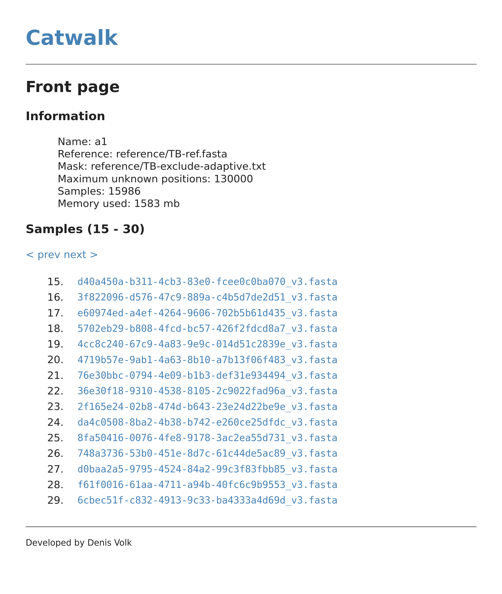

# CatWalk: a server application for microbial genomic relatedness

CatWalk is a memory-efficient server application to compute and store pairwise single nucleotide polymorphism (SNP) differences between microbial genomes.  It does not require any prior information (such as phylogenetics, lineage, or multi-locus sequence typing) to do so, and can be applied to any fixed length sequence set, such as those generated by read mapping to a reference sequence and consensus sequence calling.  A publication describing CatWalk is in progress.

CatWalk offers
* [fast](doc/software_performance.md), one-time sequence loading from a fasta file
* the ability to add new samples
* ability to query for similar sequences
* access via command line or REST-API interfaces, allowing incorporation into other components.
* a web server interface, so individuals can look up results using the web server included in the package.

A server storing bacterial genome data             |  allowing fast searches for related samples
:-------------------------:|:-------------------------:
| 

More detail is available on  
[Clinical need](doc/clinical_need.md)  

[Installation](doc/installation.md)  
[How to use the server](doc/use.md)  
[REST API endpoints and python client](doc/api.md)  
[Benchmarking](../benchmark/README.md)  
[Miscellaneous utilities](doc/utils.md)  

